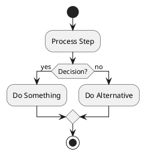

# PlantUML MCP for Flowchart Creation

This project is set up with PlantUML MCP (Model Context Protocol) integration for creating and editing flowcharts using Claude Code.

## Project Structure

```
kabam_iron_diagrams/
├── uml-mcp/           # MCP server installation
├── diagrams/          # PlantUML source files (.puml)
│   ├── example_flowchart.puml
│   └── simple_decision_flow.puml
├── output/            # Generated diagram outputs
├── test_diagram_generation.py  # Test script
└── README.md          # This file
```

## Features

The UML-MCP server provides:
- PlantUML diagram generation
- Support for flowcharts, activity diagrams, sequence diagrams, and more
- Multiple output formats (SVG, PNG, PDF)
- Natural language to diagram conversion
- Direct PlantUML syntax support

## Usage

### Creating Flowcharts

1. Create `.puml` files in the `diagrams/` directory
2. Use PlantUML activity diagram syntax for flowcharts
3. Common elements:
   - `start` / `stop` - Begin/end points
   - `:Action;` - Process steps
   - `if (condition?) then (yes)` - Decision points
   - `fork` / `end fork` - Parallel activities
   - `while` loops
   - `switch` statements
   - `partition` for grouping

### Example Flowchart Syntax



### Testing Diagram Generation

Run the test script to generate URLs for your diagrams:

```bash
python3 test_diagram_generation.py
```

This will output URLs that you can open in your browser to view the generated diagrams.

## MCP Server Configuration

The PlantUML MCP server is configured in Claude Code and can be accessed using:
- Tool: `generate_uml` - Generate diagrams from PlantUML code
- Resource: `uml://info` - Get server information

### Setup Instructions

1. **Install the MCP server** (if not already installed):
   ```bash
   cd uml-mcp
   python3 -m venv venv
   venv/bin/pip install -r requirements.txt
   ```

2. **Configure in Claude Code**:
   ```bash
   claude mcp add plantuml -- /home/hanifz/ws/kabam_iron_diagrams/uml-mcp/venv/bin/python /home/hanifz/ws/kabam_iron_diagrams/uml-mcp/mcp_server.py run
   ```

3. **Restart Claude Code** after configuration changes

### Technical Details

- **Encoding**: The server uses HUFFMAN encoding (zlib compression with first 2 and last 4 bytes stripped)
- **URL Format**: Generated URLs include a `~1` prefix to indicate HUFFMAN encoding
- **Example URL**: `http://www.plantuml.com/plantuml/svg/~1[encoded-data]`

## Available Diagram Types

- Activity Diagrams (Flowcharts)
- Sequence Diagrams
- Class Diagrams
- Use Case Diagrams
- State Diagrams
- Component Diagrams
- And more PlantUML-supported formats

## Tips

1. Use `!theme plain` for clean, simple diagrams
2. Add colors with `#colorname:Text;`
3. Use `note` for annotations
4. Group related activities with `partition`
5. Show parallel processes with `fork`

## Resources

- [PlantUML Activity Diagram Guide](https://plantuml.com/activity-diagram-beta)
- [PlantUML Online Server](http://www.plantuml.com/plantuml)
- [UML-MCP Repository](https://github.com/antoinebou12/uml-mcp)